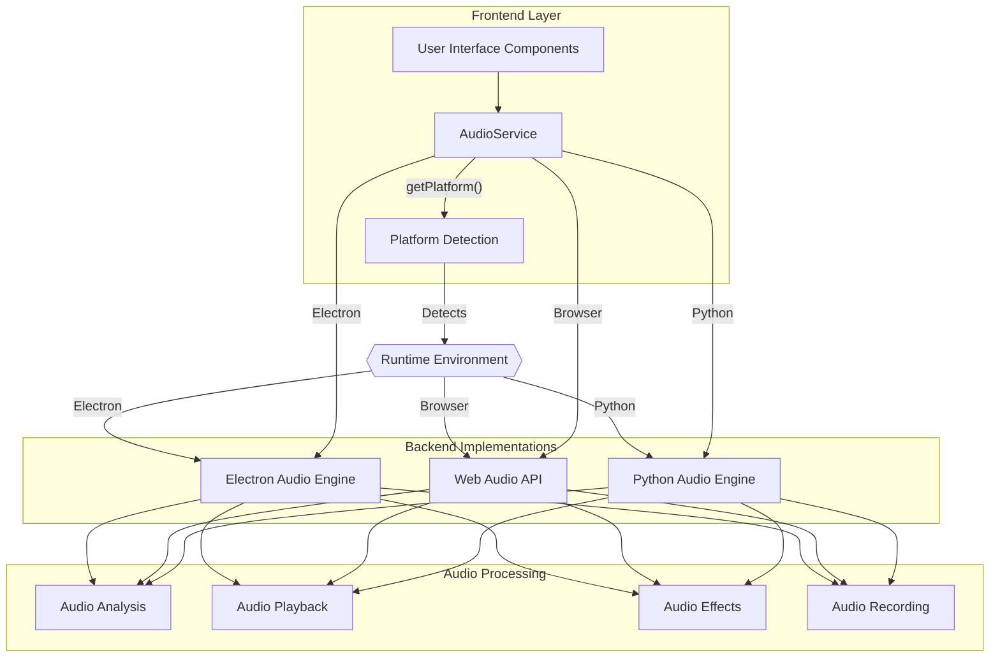

# Orpheus Engine: Audio Engine Architecture

## Overview

The Orpheus Engine features an advanced hybrid audio engine architecture with interchangeable backends. This design enables the application to adapt to different runtime environments (Electron desktop app, web browser, Python backend) while maintaining consistent functionality. The architecture is built around dynamic platform detection and service routing, allowing the system to automatically select the optimal audio processing backend based on the environment.

## Hybrid Architecture Design



## Platform Detection & Audio Backend Selection

The Orpheus Engine uses a sophisticated platform detection system to determine the appropriate audio backend. This is handled primarily through the `PlatformService` and `AudioService` classes:

### Platform Detection

The `PlatformService` class provides methods to detect the runtime environment:

```typescript
// From PlatformService.ts
static isElectron(): boolean {
  // Check for process.versions.electron
  if (typeof process !== 'undefined' && process.versions && process.versions.electron) {
    return true;
  }
  // Check for electronAPI global
  if (typeof globalThis !== 'undefined' && (globalThis as any).electronAPI) {
    return true;
  }
  // Check user agent for Electron
  if (typeof navigator !== 'undefined' && navigator.userAgent) {
    return navigator.userAgent.toLowerCase().includes('electron');
  }
  return false;
}

static isBrowser(): boolean {
  if (this.isElectron()) return false;
  return typeof window !== 'undefined' && typeof navigator !== 'undefined' && !this.isPython();
}

static isPython(): boolean {
  // Check for process.versions.python
  if (typeof process !== 'undefined' && process.versions && process.versions.python) {
    return true;
  }
  // Check for Python environment variable
  if (typeof process !== 'undefined' && process.env && process.env.PYTHON_BACKEND === 'true') {
    return true;
  }
  return false;
}
```

### Audio Backend Selection

The `AudioService` uses the platform detection to route audio operations to the appropriate backend:

```typescript
// From AudioService.ts
getPlatform(): 'electron' | 'browser' | 'python' {
  if (PlatformService.isElectron()) return 'electron';
  if (PlatformService.isBrowser()) return 'browser';
  if (PlatformService.isPython()) return 'python';
  return 'browser'; // fallback
}

async analyzeAudio(fileOrBuffer: File | AudioBuffer): Promise<any> {
  const platform = this.getPlatform();

  switch (platform) {
    case 'electron':
      return this.analyzeAudioElectron(fileOrBuffer as File);
    case 'browser':
      return this.analyzeAudioBrowser(fileOrBuffer);
    case 'python':
      return this.analyzeAudioPython(fileOrBuffer as File);
    default:
      throw new Error('Unsupported platform');
  }
}
```

## Backend Implementations

### 1. Electron Audio Engine

- **Description**: Native desktop audio processing using Node.js and Electron's IPC bridge
- **Strengths**: Lower latency, access to file system, native audio drivers
- **Activation**: Automatically selected when running in Electron environment

```typescript
private async analyzeAudioElectron(file: File): Promise<any> {
  if (!(globalThis as any).electronAPI) {
    throw new Error('Electron API not available');
  }

  const arrayBuffer = await file.arrayBuffer();
  return (globalThis as any).electronAPI.analyzeAudio({
    filePath: undefined, // File path would be handled by Electron
    buffer: arrayBuffer,
    options: { includeWaveform: true, includePeaks: true },
  });
}
```

### 2. Web Audio API

- **Description**: Browser-based audio processing using the Web Audio API
- **Strengths**: Cross-platform compatibility, no installation required, broad browser support
- **Activation**: Automatically selected when running in a browser environment

```typescript
private async analyzeAudioBrowser(fileOrBuffer: File | AudioBuffer): Promise<any> {
  if (!globalThis.AudioContext && !(globalThis as any).webkitAudioContext) {
    throw new Error('Web Audio API not supported');
  }

  let audioBuffer: AudioBuffer;
  if (fileOrBuffer instanceof File) {
    const arrayBuffer = await fileOrBuffer.arrayBuffer();
    if (!this.audioContext) {
      await this.initialize();
    }
    audioBuffer = await this.audioContext!.decodeAudioData(arrayBuffer);
  } else {
    audioBuffer = fileOrBuffer;
  }

  return {
    duration: audioBuffer.duration,
    sampleRate: audioBuffer.sampleRate,
    numberOfChannels: audioBuffer.numberOfChannels,
    length: audioBuffer.length,
    waveform: this.generateWaveform(audioBuffer.getChannelData(0), 1000),
    peaks: this.extractPeaks(audioBuffer),
  };
}
```

### 3. Python Audio Backend

- **Description**: Server-side audio processing using Python's powerful audio libraries
- **Strengths**: Advanced ML/AI capabilities, professional audio analysis, batch processing
- **Activation**: Used in specialized environments or when AI processing is required

```typescript
private async analyzeAudioPython(file: File): Promise<any> {
  const endpoint = PlatformService.getApiEndpoint();
  const arrayBuffer = await file.arrayBuffer();

  const response = await fetch(`${endpoint}/api/audio/analyze`, {
    method: 'POST',
    headers: {
      'Content-Type': 'application/json',
    },
    body: JSON.stringify({
      fileName: file.name,
      fileType: file.type,
      audioData: Array.from(new Uint8Array(arrayBuffer)),
    }),
  });

  if (!response.ok) {
    throw new Error(`HTTP error! status: ${response.status}`);
  }

  return response.json();
}
```

## Integration with Service Manager

In Electron mode, the Python backend services are registered and managed by the `ServiceManager` class:

```javascript
// From main.js in Electron
registerServices() {
  // Audio Processing Service (if available)
  this.serviceManager.registerService({
    name: 'audio',
    command: 'python',
    args: ['audio_service.py'],
    cwd: path.join(rootPath, 'workstation', 'backend'),
    port: 7008,
    description: 'Audio Processing Service',
    critical: false
  });
}
```

## Current Implementation Status

| Feature | Electron Backend | Web Audio API | Python Backend |
|---------|------------------|--------------|----------------|
| Audio Playback | ✅ Implemented | ✅ Implemented | ⚠️ Partial |
| Basic Audio Analysis | ✅ Implemented | ✅ Implemented | ✅ Implemented |
| Advanced Audio Effects | ✅ Implemented | ⚠️ Limited | ✅ Implemented |
| File System Access | ✅ Native | ⚠️ Limited | ✅ Server-side |
| ML/AI Audio Analysis | ⚠️ Via Python | ❌ Not Available | ✅ Implemented |

## Configuration Options

The hybrid audio engine can be configured using environment variables:

```bash
# Python Backend Configuration
PYTHON_BACKEND=true      # Force Python backend mode
VITE_API_ENDPOINT=http://localhost:5001  # Custom API endpoint

# Audio Engine Configuration
AUDIO_HOST=localhost     # Audio processing service host
AUDIO_PORT=7008          # Audio processing service port 
```

## Future Plans

1. **Enhanced synchronization** between backends for seamless switching
2. **Real-time audio processing** improvements across all backends
3. **Advanced ML/AI integration** with the Python backend for feature extraction
4. **WebAssembly audio engine** for high-performance browser processing
5. **Cloud audio processing** for resource-intensive tasks

## Technical Considerations

1. **Performance**:
   - Electron backend provides the lowest latency for real-time audio processing
   - Web Audio API is optimized for browser environments but has limitations
   - Python backend offers the most advanced analysis but with higher latency

2. **Compatibility**:
   - Web Audio API requires browser support (Chrome 74+, Firefox 75+, Safari 14.1+)
   - Python backend requires server connection and proper CORS configuration
   - Electron backend works on all desktop platforms with proper drivers

3. **Development Workflow**:
   - Use `npm run dev:hybrid` for testing all backends
   - Use `npm run dev:electron` for Electron-specific development
   - Use `npm run dev:browser` for web browser testing
